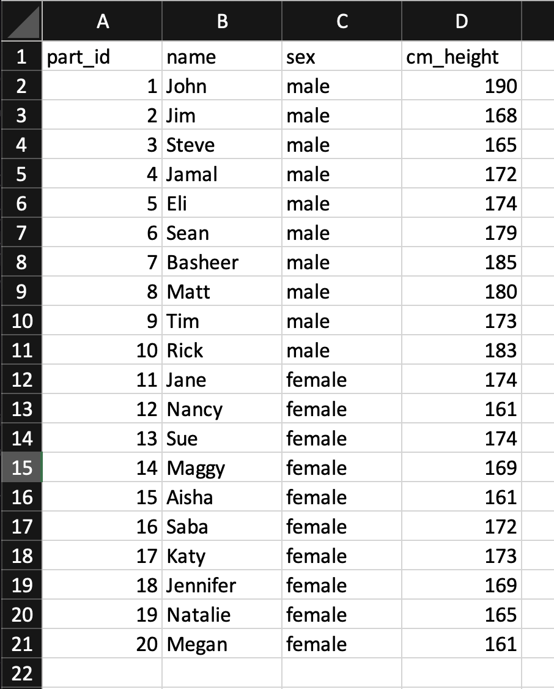
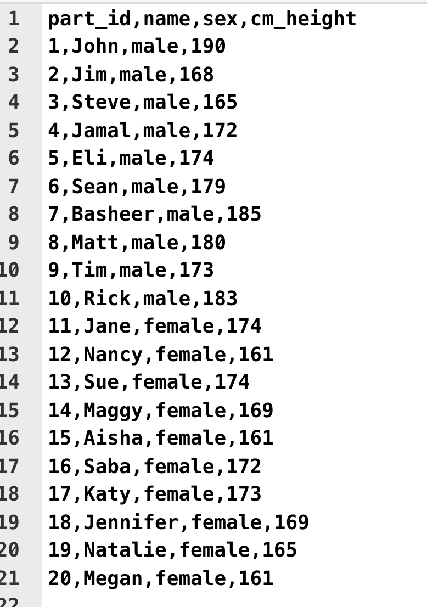
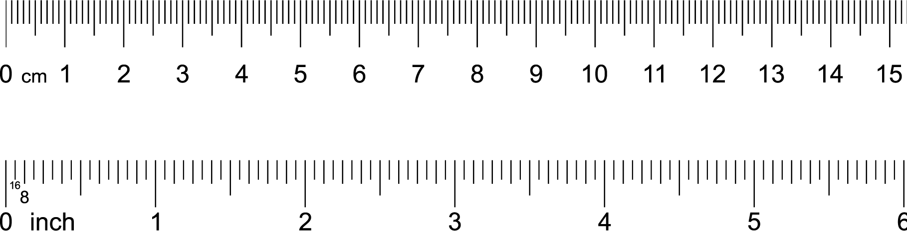

# Scaling


## Notation

In this chapter we will use summation notation. If you are not familiar with summation notation, we present a brief overview here.

Consider a scenario where we have the IQ data for three participants We use the N symbol to represent the number of participants. Because we have three participants N = 3. The data for these participants is illustrated in Figure \@ref(fig:notationdata).

Notice how each person in the data set can be represented by the variable X: the first person by $X_1$, the second by $X_2$, and the third by $X_3$. Often we refer to individuals in a data set by using the variable X accompanied by a subscript (e.g., 1, 2, 3, etc.).

```{r notationdata, echo = FALSE, out.width="40%", fig.cap = "Data for understanding summation notation"}
knitr::include_graphics("ch_scaling/images/screenshot_data_n6.png")
```

Referring to participants using the variable X and subscript is valuable because it can be used in conjunction with the sigma (i.e., $\Sigma$) symbol for summation. Consider the example below in which we use the summation notation to indicate that we want to add all the X values (representing IQ) for the participants. We use a lower case $i$ to represent all possible subscript values. The notation, $i$ = 1, below the $\Sigma$ symbol indicates that we should start with participant 1. The notation, N, above the $\Sigma$ symbol indicates that we should iterate $i$ up to the value indicated by N; in this case 3, because there are three participants.

$$
\begin{aligned} 
\sum_{i=1}^{N} X_i &=  X_1 + X_2 + X_3\\ 
&= 110 + 120 + 100 \\
&= 330
\end{aligned} 
$$

Sometimes, to simplify the notation, the numbers above and below the $\Sigma$ symbol are omitted. Likewise, the $i$ subscript is omitted. There is a general understanding that when these components of the notation are omitted the version of the notation above is implied.

$$
\begin{aligned} 
\sum{X} &= X_1 + X_2 + X_3\\ 
&= 110 + 120 + 100\\
&= 330
\end{aligned} 
$$


**Calculating a mean**. The full version of the notation can be used to indicate how an average/mean is calculated.


$$
\begin{aligned} 
\bar{X} &= \frac{\sum_{i=1}^{N} X_i}{N} \\
&= \frac{X_1 + X_2 + X_3}{3}\\ 
&= \frac{110 + 120 + 100}{3}\\
&= \frac{330}{3}\\
&= 110\\
\end{aligned} 
$$

Likewise, the concise version of the notation can be used to indicate how an average/mean is calculated.

$$
\begin{aligned} 
\bar{X} &= \frac{\sum{X}}{N} \\
&= \frac{X_1 + X_2 + X_3}{3}\\ 
&= \frac{110 + 120 + 100}{3}\\
&= \frac{330}{3}\\
&= 110\\
\end{aligned} 
$$


**Calculating squared differences**.A common task in statistics is to calculate 1) the squared difference between each person and the mean, and 2) add up those squared differences. This calculation is easily expressed with the full version of the notation.

$$
\begin{aligned} 
\sum_{i=1}^{N}{(X_i - \bar{X})^2} &= (X_1-\bar{X})^2 + (X_2-\bar{X})^2 + (X_3-\bar{X})^2\\ 
&= (110-110)^2 + (120-110)^2 + (100-110)^2\\
&= (0)^2 + (10)^2 (-10)^2 \\
&= 0 + 100 + 100 \\
&= 200
\end{aligned} 
$$

Likewise, the sum of the squared differences from the mean can be expressed using the concise version of the notation.

$$
\begin{aligned} 
\sum{(X - \bar{X})^2} &= (X_1-\bar{X})^2 + (X_2-\bar{X})^2 + (X_3-\bar{X})^2\\ 
&= (110-110)^2 + (120-110)^2 + (100-110)^2\\
&= (0)^2 + (10)^2 (-10)^2 \\
&= 0 + 100 + 100 \\
&= 200
\end{aligned} 
$$

## Measurement Notation

```{r, include=FALSE}
knitr::opts_chunk$set(echo = TRUE)

library(tidyverse)
library(sjstats) # say no if complied ...
height_data <- read_csv("data_heights.csv", na = c("", "-999"))

```

You may be familiar with the notation typically used when making inferences from a sample to a population. Unfortunately, the notation used in Psychological Measurement is different - similar but different. For the purposes of this course we use the notation and formulas below. Notice that we use N in the denominator - that is we use the population-level variance formula - even though we are working with sample data. Typically, measurement textbooks treat the sample as our population of interest. This difference is often a source of confusion for students.


$$
\begin{aligned}
\overline{X} &= \frac{\sum{X}}{N} \\
\end{aligned}
$$


$$
\begin{aligned}
S^2_X &= \frac{\sum{(X - \overline{X})^2}}{N} \\
\end{aligned}
$$


$$
\begin{aligned}
S_X &= \sqrt{\frac{\sum{(X - \overline{X})^2}}{N}} \\
\end{aligned}
$$


## Data entry

We begin by entering data into Excel (or any other spreadsheet) as per below. Notice how we use the first row as a header for the column names. Once we enter the data this way we need to save it as a .CSV file (comma separated values). You do so using the Save As menu item in Excel. Once the Save window appears - you will notice a File Format pull-down button. Use the button to select the CSV (comma delimited) option. Indicate a file name of "data_heights.csv" and save the file.

```{r, echo=FALSE, out.width="35%"}

```


What is a .CSV file? It's just a text file where the columns are separated by commas. If you were to open the file in TextEdit on a Mac (or Notepad on Windows) you would see something like the image below. You don't need to do this step - but if you did, it would just show you how the file is saved on disk.

```{r, echo=FALSE, out.width="25%"}

```


## Loading data

Begin by creating a Project in RStudio on your computer (or via RStudio Cloud). Place the "data_heights.csv" in the Project folder. If you are using R Studio Cloud this means uploading the file via the Upload button the File tab (see picture below):

```{r, echo=FALSE, out.width="50%"}

```


Prior to loading the data we have to install the tidyverse and sjstats packages. This only needs to be done once if you are using RStudio your computer. If you are using RStudio in the Cloud you need to do it once for each project/workspace. You install these packages by typing the command below in the CONSOLE. Do NOT put these commands in your script. It will take some time to run. Don't worry about all the text feedback you see on the screen.

```{r, eval = FALSE}
install.packages("tidyverse", dep = TRUE)
install.packages("sjstats", dep = TRUE)
```


From this point on place all the R commands into your script. We begin by activating the tidyverse and sjstats packages with the library() command. Then we load the data using read_csv(). Notice how use indicate missing values using the **na** argument of the read_csv() command; if the computer see nothing in the column or -999 it puts in a missing value place holder.

```{r, eval = TRUE}
library(tidyverse)
library(sjstats)

height_data <- read_csv("data_heights.csv", na = c("", "-999"))
```

We can see the columns in the data we loaded using the glimpse() command:

```{r}
glimpse(height_data)
```

The sex and part_id (participant identification number) columns are categorical variables. We need to let the R know this fact. We do so by converting them to "factor" columns with the command below.

```{r}
height_data <- height_data %>%
  mutate(part_id = as_factor(part_id),
         sex = as_factor(sex))

```

Using glimpse() again we see these columns have fct after them indicating that they are factors (i.e., categorical variables):

```{r}
glimpse(height_data)
```

## Viewing data

We can view all of the data we entered with the command below:

```{r}
height_data %>% as.data.frame()
```


## Summary statistics

To obtain the mean and standard deviation (population formula) for each column in the data set we use the commands below. These are fulling explained in the previous "Handling data with the tidyverse" chapter.

```{r}
desired_descriptives <- list(
  mean = ~mean(.x, na.rm = TRUE),
  sd_pop = ~sd_pop(.x)
)

height_data %>%
    summarise(across(.cols = where(is.numeric),
                     .fns = desired_descriptives,
                     na.rm = TRUE)) %>%
  as.data.frame()
```


## Converting units


### Inches

In the previous sections we have examined participant heights using centimeters (cm). We can, however, express participants heights using inches. It's a simple process to convert cm to inches - we simply divide by 2.54. If you examine the rule below you can see that 2.54 cm corresponds to 1 inch.

```{r, echo=FALSE, out.width = "50%"}

```

#### Hand calculation

We can express this conversion more formally with equations below. In this Equation we use $X_i$ to indicate the height (in cm) of the $i^{th}$ person in a set of N people.

$$
\begin{aligned}
\text{height in inches for the ith person} = \frac{X_i}{2.54}\\
\end{aligned}
$$


In the context of our data we can convert John's height of 190 cm to inches using this process:

$$
\begin{aligned}
\text{height in inches for the ith person} &= \frac{X_i}{2.54}\\
&= \frac{\text{John's height in cm}}{2.54}\\
&= \frac{190}{2.54}\\
&= 74.80315
\end{aligned}
$$


Thus, John is 190 cm tall or 74.8 inches tall. Of course, John's height has not changed because we are now expressing it in inches. All that has changed is the units we use to indicate his height.


#### R calculation

We can create a new column in our data set that has the height of everyone in inches using the code below:

```{r}

height_data <- height_data %>%
  mutate(inch_height = cm_height / 2.54)
```

We can see the new column (inches) with the code below.

```{r}
height_data %>% as.data.frame()
```

We can obtain the mean and standard deviation (population formula) for the cm and inches columns with the command below. Note that we added "%>% t()" in this version - this simply transposes the row to a column so the results don't go off the right side of your screen.

```{r}
desired_descriptives <- list(
  mean = ~mean(.x, na.rm = TRUE),
  sd_pop = ~sd_pop(.x)
)

height_data %>%
    summarise(across(.cols = where(is.numeric),
                     .fns = desired_descriptives,
                     na.rm = TRUE)) %>%
  as.data.frame() %>% t()
```


#### Summary

```{r, echo = FALSE}
desired_descriptives <- list(
  mean = ~mean(.x, na.rm = TRUE),
  sd_pop = ~sd_pop(.x),
  N = ~sum(!is.na(.x))
)

row_sum <- height_data %>% 
  summarise(across(.cols = where(is.numeric),
                   .fns =  desired_descriptives,
                   .names = "{col}___{fn}"))

long_summary <- row_sum %>%
  pivot_longer(cols = everything(),
               names_to = c("unit", "stat"),
               names_sep = c("___"),
               values_to = "value")

summary_table <- long_summary %>% 
  pivot_wider(names_from = stat,
              values_from = value)

# round to 3 decimals
summary_table_rounded <- summary_table %>%
  mutate(across(.cols = where(is.numeric),
                .fns= round,
                digits = 3)) %>%
  as.data.frame()

kableExtra::kable(summary_table_rounded)
```


Examine the summary table above. By converting heights in cm to heights in inches we simply changed the units used to represent those heights. The conversion did not change anyone's actual height. Nor did this conversion change the height of one person relative to another person -- all we did was change the units used to represent the heights.

Both inches and centimeters are ratio-scale scale heights. The zero point on the measurement scale is meaningful and not arbitrary. Below we examine two approaches to representing heights (*z*-scores and T-scores) for which the zero-point depends on the nature of the data. This initially seems like an odd approach - but you will that there are many benefits to expressing scores/heights in this manner. 


### *z*-scores

One alternative approach to representing scores, or more specifically heights, is using *z*-scores. With *z*-scores each person's score (i.e., height) is represented relative to a frame of reference. More specifically, scores are represented relative to a particular mean and standard deviation. Often the frame of reference (i.e., mean and standard deviation) used to calculate *z*-scores is the mean and standard deviation of all the participants in a data set - though we will see later other frames of reference are possible.

The advantage of *z*-scores is that by simply looking a person's *z*-score we can tell if they are above or below the mean for the frame of reference. Specifically, when *z*-scores are positive this indicates that a person is above the mean for the frame of reference; likewise, when *z*-score are negative this indicates that the person is below the mean for the frame of reference. The magnitude of the *z*-score indicates how distant that person is from the mean of the frame of reference in standard deviation units. 

In we example our data we find that John has a height of 190 cm. We use the heights of the people in our data set as a frame of reference. Specifically, we calculate a mean height of 173.3 cm and a standard deviation (population formula) of 8.013114 cm. We use these values as a frame of reference when calculating John's *z*-score. Using this frame of reference John's height of 190 cm can be expressed as a *z*-score of 2.08408360 (calculation below). Because this is a positive value we know John is taller than the average person in the frame of reference (i.e, the people in our data set). Likewise, the magnitude of the *z*-score, 2.08408360, indicates that John is 2.08408360 standard deviations taller than the average person in our frame of reference (i.e., our data set). This means that John is quite tall - **relative** to the other people in our data set. The key word here is **relative** - *z*-scores provide information about a person's score relative to some frame of reference. In this example, the frame of reference was all of the people in the data set.


#### Hand calculation

Let's walk through converting John's height from cm to a *z*-score. The first step is determine the frame of reference we want to use to calculate the *z*-score. We decide to use the entire data set a frame of reference.

We find that the for the entire data set we have the mean and standard deviation (population formula) below that will serve as a frame of reference.

$$
\begin{aligned}
\overline{X} &= 173.3 \\
S_X &= 8.013114 \\
\end{aligned}
$$


To convert a person's original score to a *z*-score we use the formula below. Notice that the formula contains their original score (i.e., $X_i$) as well and the mean (i.e., $\overline{X}$) and standard deviation (i.e., $S_X$) of the frame of reference.

$$
\begin{aligned}
z_i = \frac{X_i - \overline{X}}{S_X}\\
\end{aligned}
$$


Here is the calculation for John:

$$
\begin{aligned}
z_i &= \frac{X_i - \overline{X}}{S_X}\\
&= \frac{\text{(John's height in cm)} - \overline{X}}{S_X}\\
&= \frac{190 - 173.3}{8.013114}\\
&= \frac{16.7}{8.013114}\\
&= 2.084084\\
\end{aligned}
$$


#### R calculation

We can do the same in R with the code below. Where you see **mean(cm_height)** the computer substitutes the mean of cm_height column (i.e., 173.3). Likewise, where you see **sd_pop(cm_height)** the computer substitutes the standard deviation of cm_height column (i.e., 8.013114).

```{r}

height_data <- height_data %>%
  mutate(z_height = (  cm_height - mean(cm_height)  )  /  sd_pop(cm_height)  )
```

Notice that we now have a new column in R with this information:

```{r}
height_data %>% as.data.frame()
```


We can obtain the mean for the cm, inches, and *z*-score columns with the command below:


```{r}
desired_descriptives <- list(
  mean = ~mean(.x, na.rm = TRUE),
  sd_pop = ~sd_pop(.x)
)

height_data %>%
    summarise(across(.cols = where(is.numeric),
                     .fns = desired_descriptives,
                     na.rm = TRUE)) %>%
  as.data.frame() %>% t()
```


#### Summary

We can see this information presented in table form below. You can see that *z*-scores are simply a ways of representing heights with a different type of unit. By converting heights to *z*-scores we have not changed anyone's actual height. Nor have we changed the relative heights of any two individuals. We have only changed the units used to express those heights.

```{r, echo = FALSE}
desired_descriptives <- list(
  mean = ~mean(.x, na.rm = TRUE),
  sd_pop = ~sd_pop(.x),
  N = ~sum(!is.na(.x))
)

row_sum <- height_data %>% 
  summarise(across(.cols = where(is.numeric),
                   .fns =  desired_descriptives,
                   .names = "{col}___{fn}"))

long_summary <- row_sum %>%
  pivot_longer(cols = everything(),
               names_to = c("unit", "stat"),
               names_sep = c("___"),
               values_to = "value")

summary_table <- long_summary %>% 
  pivot_wider(names_from = stat,
              values_from = value)

# round to 3 decimals
summary_table_rounded <- summary_table %>%
  mutate(across(.cols = where(is.numeric),
                .fns= round,
                digits = 3)) %>%
  as.data.frame()

kableExtra::kable(summary_table_rounded)
```

### T-scores

T-scores are simply another unit for representing scores. Do not confuse the T-score with the *t*-value in inferential statistics (a very different number).

T-scores are very similar to *z*-scores - except that they have a different mean and standard deviation. With T-scores the mean of a column is 50 and the standard deviation is 10. When T-scores are greater than 50 this indicates that a person is above the mean; likewise, when a T-scores os less than 50 this indicates that a person is below the mean. Every difference of 10 units from 50 represents a standard deviation. Thus, a person with a T-score of 60 is one standard deviation above the mean.

In our data John's height can be expressed as a T-score of 70.84084. Because this value is greater than 50 we know John is taller than the average person. Likewise, the value of 70.84084 is roughly 20 higher (i.e.,, 2*10 higher) than 50 we know John is about 2 standard deviations above the mean height.

#### Hand calculation

In our data John's height can be expressed as a *z*-score of 2.08408360. We can easily convert that z-score to a T-score using the formula below:

$$
\begin{aligned}
T_i = z_i \times 10 + 50\\
\end{aligned}
$$


Using the actual z-score for John:

$$
\begin{aligned}
T_i &= z_i \times 10 + 50\\
&= \text{(John's height as a z-score)} \times 10 + 50\\
&= 2.084084 * 10 + 50\\
&= 70.84084\\
\end{aligned}
$$

#### R calculation

We can use this same approach in R to convert all of the *z*-scores to T-scores.

```{r}

height_data <- height_data %>%
  mutate(T_height =  z_height * 10 + 50 )
```

You can see everyone's height as a T-score with this code:

```{r}
height_data %>% as.data.frame()
```


We can obtain the mean for the cm, inches, *z*-score, and T-score columns with the command below:

```{r}
desired_descriptives <- list(
  mean = ~mean(.x, na.rm = TRUE),
  sd_pop = ~sd_pop(.x)
)

height_data %>%
    summarise(across(.cols = where(is.numeric),
                     .fns = desired_descriptives,
                     na.rm = TRUE)) %>%
  as.data.frame() %>% t()
```


#### Summary

```{r, echo = FALSE}
desired_descriptives <- list(
  mean = ~mean(.x, na.rm = TRUE),
  sd_pop = ~sd_pop(.x),
  N = ~sum(!is.na(.x))
)

row_sum <- height_data %>% 
  summarise(across(.cols = where(is.numeric),
                   .fns =  desired_descriptives,
                   .names = "{col}___{fn}"))

long_summary <- row_sum %>%
  pivot_longer(cols = everything(),
               names_to = c("unit", "stat"),
               names_sep = c("___"),
               values_to = "value")

summary_table <- long_summary %>% 
  pivot_wider(names_from = stat,
              values_from = value)

# round to 3 decimals
summary_table_rounded <- summary_table %>%
  mutate(across(.cols = where(is.numeric),
                .fns= round,
                digits = 3)) %>%
  as.data.frame()

kableExtra::kable(summary_table_rounded)
```


## Comparing scores

We sort the scores by height with the command below:

```{r}
height_data_sorted <- height_data %>%
  arrange(cm_height) 
```

We remove the sex column with this command (just so the data isn't too wide for your screen).

```{r}
height_data_sorted <- height_data_sorted %>%
  select(-sex) 
```

You can see the sorted scores with the command below.

```{r}
height_data_sorted %>% as.data.frame()
```

Notice in the output above how all the people with heights below the mean of 173.3 cm have z-scores less than 0 and T-scores less than 50.


## Frame of references


### Reset

For the next few exercises lets do a bit of reset and get rid of a few columns.

```{r}
height_data <- height_data %>%
  select(-inch_height, -T_height)
```

And we can see that we have fewer columns now:

```{r}
height_data %>% as.data.frame()
```


### All participants

In the above data, the z_height column was calculated using the mean and standard deviation for all participants. Specifically, for all participants in this data set the mean and standard deviation are:

$$
\begin{aligned}
\overline{X} &= 173.3 \\
S_X &= 8.013114 \\
\end{aligned}
$$

These mean and standard deviation values were used to calculate John's z-score (and everyone else's z-scores too):

$$
\begin{aligned}
z_i &= \frac{X_i - \overline{X}}{S_X}\\
&= \frac{\text{(John's height in cm)} - \overline{X}}{S_X}\\
&= \frac{190 - 173.3}{8.013114}\\
&= \frac{16.7}{8.013114}\\
&= 2.084084\\
\end{aligned}
$$


### Male participants


```{r}
male_height_data <- height_data %>%
  filter(sex == "male") 
```

```{r}
male_height_data %>% as.data.frame()
```


```{r}
male_height_data %>%
    summarise(across(.cols = starts_with("cm"),
                     .fns = mean,
                     na.rm = TRUE,
                     .names = "mean_{col}")) %>%
  as.data.frame()
```


```{r}
male_height_data %>%
    summarise(across(.cols = starts_with("cm"),
                     .fns = sd_pop,
                     .names = "sd_{col}")) %>%
  as.data.frame()
```

For male participants

$$
\begin{aligned}
\overline{X_{males}} &= 178.7 \\
S_{males} &= 6.558201 \\
\end{aligned}
$$

$$
\begin{aligned}
z_i &= \frac{X_i - \overline{X_{males}}}{S_{males}}\\
&= \frac{190 - 178.7}{6.558201}\\
&= \frac{11.3}{6.558201}\\
&= 1.723033\\
\end{aligned}
$$


```{r}

male_height_data <- male_height_data %>%
  mutate(z_males = (cm_height - mean(cm_height))/sd_pop(cm_height)  )
```

```{r}
male_height_data %>% as.data.frame()
```


