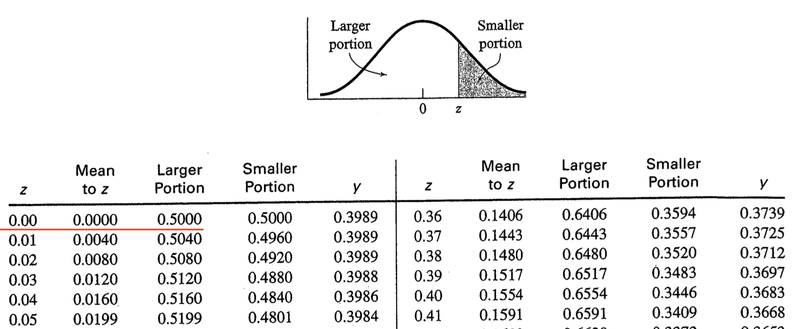

# Percentiles

```{r, include=FALSE}
knitr::opts_chunk$set(echo = TRUE)
library(tidyverse)
library(sjstats) # say no if complied ...

T2z <- function(T){
  z = (T-50)/10
  return(z)
}

get_fill_distribution <- function(z_position) {
  xinit <- seq(-3, 3, by = .01)
  yinit <- dnorm(xinit)
  x <- c(-3, xinit, 3)
  y <- c(0, yinit, 0)
  
  xfill <- c(-3, xinit[xinit <= z_position], z_position)
  yfill <- c(0,  yinit[xinit <= z_position], 0)
  
  df <- data.frame(x, y)
  df_fill <- data.frame(x = xfill, y = yfill)
  
  df_out <- list(
    dist_data = df,
    fill_data = df_fill
  )
}

get_z_graph <- function(z_position=.50, is_T = FALSE) {
  df_plot <- get_fill_distribution(z_position)
  dist_data <- df_plot$dist_data
  fill_data <- df_plot$fill_data

  percent_fill <- round(pnorm(z_position) *100)
  if (is_T == FALSE) {
    title_str <- sprintf("%1.1f%% people in reference group below z = %1.2f", percent_fill, z_position)
  } else {
    title_str <- sprintf("%1.1f%% people in reference group below T = %1.2f", percent_fill, z_position*10)
  }
  
  myplot <-ggplot(data = dist_data, mapping = aes(x = x, y = y)) +
    geom_polygon(fill = "white", color = "black") + 
    geom_polygon(data = fill_data, fill = "black", color = "black") +
    scale_x_continuous(breaks = seq(-3, 3, by = .5)) +
    labs(x = "*z*-score", y = "Density") +
    ggtitle(title_str) +
    theme_classic(18) +
    theme(plot.title = element_text(size = 14, face = "bold"))
  
  return(myplot)
}


height_data <- read_csv("data_heights.csv", na = c("", "-999"))

height_data <- height_data %>%
  mutate(part_id = as_factor(part_id),
         sex = as_factor(sex))

height_data <- height_data %>%
  mutate(inch_height = cm_height / 2.54)

height_data <- height_data %>%
  mutate(z_data = (  cm_height - 173.3  )  /  8.013114  )

height_data <- height_data %>%
  mutate(T_data =  z_data * 10 + 50 )

male_height_data <- height_data %>%
  filter(sex == "male") 

male_height_data <- male_height_data %>%
  mutate(z_data_males = (cm_height - 178.7)/ 6.558  )

male_height_data <- male_height_data %>%
  mutate(z_canada_male = (cm_height - 186.1)/ 7.20  )
```

In the previous chapter, we calculated *z*-scores for males in our sample. We calculated the *z*-scores using three different frames of references: all sample data (male and female), male sample data, and Canadian males. Recall that a *z*-score provides information relative to a frame of reference (e.g., all sample data, male sample data, Canadian males). For a given frame a reference, a *z*-score of 0 represents the mean of that frame of reference. Positive *z*-scores indicate participants above the mean for the frame of reference whereas negative *z*-score indicate participants below the mean for the frame of reference. A value of 1 corresponds to one standard deviation. Therefore, a person with a *z*-score of 2 is two standard deviations above the mean.

## Assuming a normal distribution approach

### A single case

If we assume our frame of reference has a normal distribution, we can calculate for one person the proportion of people who scored the same or lower than them. We multiply that proportion by 100 and we have the percentage, The percentage indicates the percentage of people who score the same or lower than them. We refer to this number as the **percentile** for that person. 

Imagine a person has a *z*-score of 0 relative to some reference group. If the distribution is normal, we can determine the **proportion** of people, in the reference group, that have the same score or a lower score using the command pnorm() command below. We simply put the z-score in the brackets of the pnorm() command:

```{r}
pnorm(0)
```

We see that the **proportion** of people in the reference group with a *z*-score of zero or lower is 0.50.

We can convert this proportion to a percentage by mulitplying it by 1000:

```{r}
0.500 * 100
```

We see the percentage is 50%. This indicates that 50% of the reference group had a *z*-score of 0 or lower -- assuming the distribution is normal. We illustrate this graphically below:

```{r, echo = FALSE}
get_z_graph(0)
```


Of course, the pnorm(0) command is the same as looking up a value of zero in a *z*-table -- as illustrated below. Examine the first row that is underlined in red. Notice the value of 0 in the *z* column (indicating a *z*-score of zero). Then examine the "Larger portion" column and notice the .50 value. This .50 indicates the proportion of the distribution is below a *z*-score of zero (i.e., .50 or 50%). As noted, examining the table in this way is the same as running pnorm(0) command. 

```{r, echo = FALSE}

```

### Many cases using R

Let's return to the male_height_data from the previous chapter. We begin with the data set as it existed at the end of the last chapter. We take only a few essential columns from that data and place them into a new data set called male_height_canada_percentiles with commands below. Note that we use **arrange(desc(cm_height))** to sort the order of the rows so that the tallest people are at the top of the table. The desc() function makes the order of the rows based on cm_height **desc**ending.

```{r}
male_height_canada_percentiles <- male_height_data %>%
  select(name, cm_height, z_canada_male) %>%
  arrange(desc(cm_height))

print(male_height_canada_percentiles)
```

For each person we will calculate the proportion of the distribution of Canadian males that the same height or shorter than them via the normal distribution. We will place this information in the proportion_lower column. The proportion_lower column is calculated via the mutate() command using pnorm(). Following creation of the proportion_lower column we create the percentile column by multiplying the proportion_lower column by 100 - again using the mutate() command:

```{r}
male_height_canada_percentiles <- male_height_canada_percentiles %>%
  mutate(proportion_lower = pnorm(z_canada_male)) %>%
  mutate(percentile = proportion_lower * 100)

print(male_height_canada_percentiles)
```

Examine the pattern of results for these males. Pay particular attention to the percentile column for Rick, Basheer, and John. For each of these cases we create a graph (based on the numbers in the table above) to illustrate the percentage of Canadian males that are shorter (i.e., have lower height values). Keep in mind, when we calculate the "percentage lower" the resulting number is always for the same frame of reference that we used to calculate the *z*-score. In this case, the *z*-scores (z_canada_male) used all Canadian males as the frame of reference.


```{r, echo = FALSE}
z_rick <- male_height_canada_percentiles %>%
  filter(name == "Rick") %>%
  pull(z_canada_male)

z_basheer <- male_height_canada_percentiles %>%
  filter(name == "Basheer") %>%
  pull(z_canada_male)


z_john <- male_height_canada_percentiles %>%
  filter(name == "John") %>%
  pull(z_canada_male)

```

#### Rick

Rick had a *z*-score of $z$ = -0.43 when using all Canadian males as a frame of reference. He is 0.43 standard deviations shorter than the average Canadian male. If we assume the heights of Canadian males are normally distributed, as we did in the calculations above, we find that 33% of Canadian males are shorter than Rick. We say Rick is in the 33rd percentile.


```{r, echo = FALSE}
get_z_graph(z_rick)
```

#### Basheer

Basheer had a *z*-score of $z$ = -0.15 when using all Canadian males as a frame of reference. He is 0.15 standard deviations shorter than the average Canadian male. If we assume the heights of Canadian males are normally distributed, as we did in the calculations above, we find that 44% of Canadian males are shorter than Basheer. We say Basheer is in the 44th percentile.


```{r, echo = FALSE}
get_z_graph(z_basheer)
```

#### John

John had a *z*-score of $z$ = .54 when using all Canadian males as a frame of reference. He is 0.54 standard deviations taller than the average Canadian male. If we assume the heights of Canadian males are normally distributed, as we did in the calculations above, we find that 71% of Canadian males are shorter than John. We say John is in the 71st percentile.

```{r, echo = FALSE}
get_z_graph(z_john)
```

## Assumption free approach

The decision to assume a normal distribution, as we did above, depends on a few things. In order to make a normal distirbution assumption we would a) want to ensure we had a very large number of people in our frame of reference and b) that the shape was actually normal - as determined by a visual inspection of a histogram or a statistical test. If both of these things are true we can use the normal distribution to calculate a percentile for each person. If both of these things are not true - we need to use another approach. That's the focus of this section.


1. Rank order the participants in the frame of reference by attribute of interest (e.g., height) so the larger numbers are at the top of the list

2. Determine how many people in the frame of reference have scores below each person on the attribute of interest.

3. Divide the "number below" by the total number of people in the frame of reference.


We will follow these steps using R.

We begin by creating a new data set called male_height_sample_percentiles we include just the **name** and **cm_height** columns in this data set.

```{r}
male_height_sample_percentiles <- male_height_data %>%
  select(name, cm_height)

print(male_height_sample_percentiles)
```

**Step 1: Sort by height**
We sort the rows by height - ensuring the tallest males are at the top of the list by using the   arrange(desc(cm_height)) command:

```{r}
male_height_sample_percentiles <- male_height_sample_percentiles %>%
  arrange(desc(cm_height))

print(male_height_sample_percentiles)
```


**Step 2: Number below**

Because the heights are now sorted we can determine the number of people on the list below each person just by their position in the list. For example, John is the tallest and there 9 people shorter than him. Basheer is the second tallest and there are 8 people shorter than him. We need a column of numbers with the values 9, 8, 7, 6, 5, 4, 3, 2, 1, 0. We use the command: n():1. The n() refers to the number of people in the data set. Correspondingly, n():1 creates the numbers 10, 9, 8, 7, 6, 5, 4, 3, 2, 1. We subtract 1 from these values to obtain 9, 8, 7, 6, 5, 4, 3, 2, 1, 0.

```{r}
male_height_sample_percentiles <- male_height_sample_percentiles %>%
  mutate(number_below = n():1 - 1)

print(male_height_sample_percentiles)
```

**Step 3: Calculate percentile**

We create a new column called proportion_lower using a mutate() command.  In this column we index the proportion of people with the same height or a shorter height by dividing each value in the number_below column by the total number of people (obtained via the n() command). Following this we create a percentile column by multiplying the values in the proportion_lower column by 100.

```{r, eval = TRUE}
male_height_sample_percentiles <- male_height_sample_percentiles %>%
  mutate(proportion_lower = number_below / n()) %>%
  mutate(percentile = proportion_lower * 100)

print(male_height_sample_percentiles)
```

If you inspect the percentile column above you can see how we calculated the percentile for each person in the data set without using the normal distribution or z-scores.


