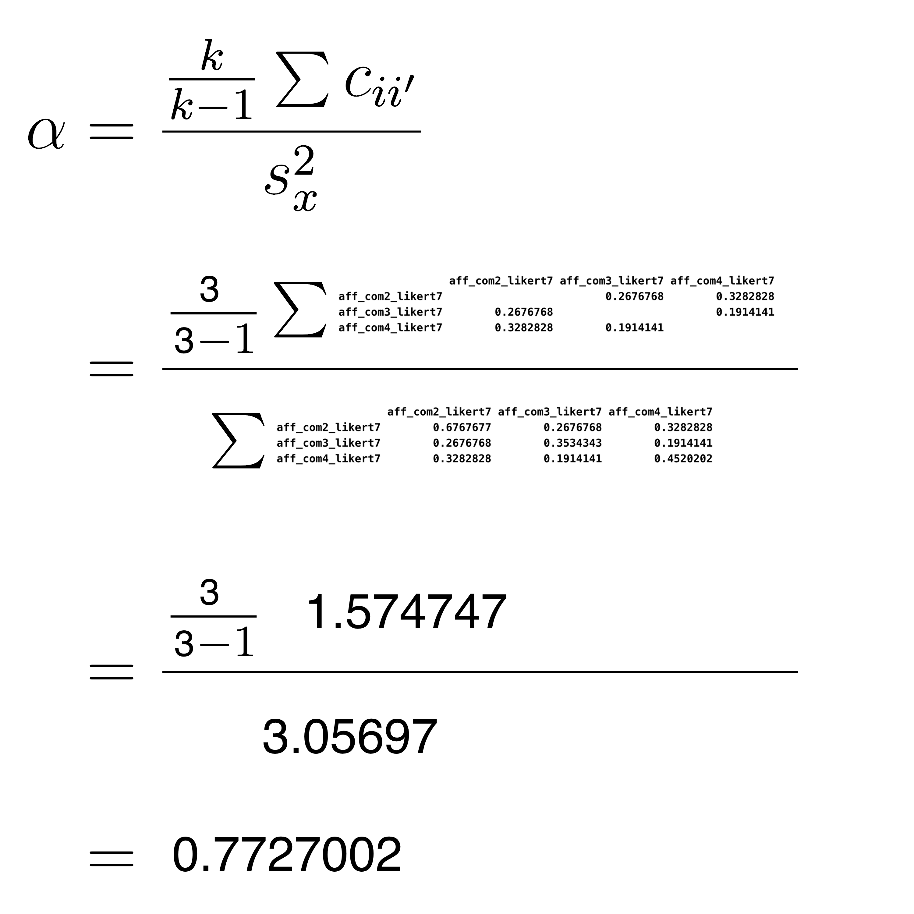
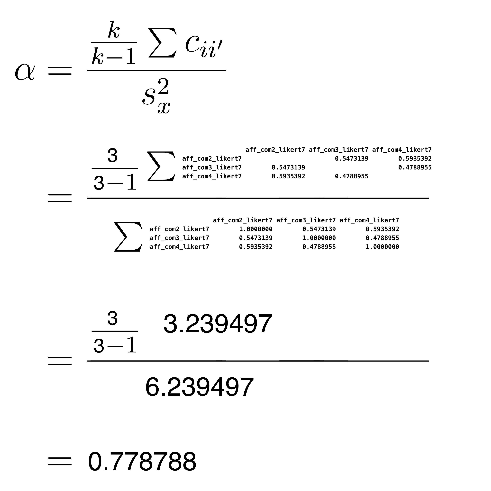

# Week 4 Friday Workshop


```{r, include=FALSE}
library(tidyverse)
library(janitor)
library(skimr)
```

## Required Packagess

The data files below are used in this chapter. The files are available at: https://github.com/dstanley4/psyc3250bookdown


| Required Data |
|-------------------|
|[data_aff_survey.csv](data_aff_survey.csv)|


The following CRAN packages must be installed:

| Required CRAN Packages |
|-------------------|
|tidyverse          |
|janitor            |
|skimr              |
|psych               |

**Important Note:** You should NOT use library(psych) at any point! There are major conflicts between the psych package and the tidyverse. We will access the psych package commands by preceding each command with psych:: instead of using library(psych).

The complete script for this project can be download here: [script_workshop2.R](script_workshop2.R)

## Goals

For this workshop our goals are to learn how to:

* Calculate **Cronbach's alpha** using a covariance matrix 

* Calculate **Cronbach's alpha** using the **psych::alpha() command**

* Calculate **standardized** alpha using a covariance matrix 

* Calculate **standardized** alpha using the **psych::alpha() command**

* All of the above goals assume familiarity with past workshops.

* DON'T WORRY ABOUT THE MATH. WE WILL COVER IT IN A FUTURE LECTURE.


## Install packages

You will need the same packages installed as you did for the Week 2 Friday workshop. However, we also need the **psych** package this week. You can install the **psych** package using the command below.

```{r,eval=F}
install.packages("psych", dep = TRUE)
```

**WARNINGS**: 1) Remember never put an install.packages() command in your script. Only ever type install.packages() commands into the Console. 2) NEVER use the library(psych) command, doing so breaks the tidyverse. We will use another approach to access commands in this package.


## RStudio Project

1. Create a folder on your computer for the example

2. Download the data file for this example: [data_aff_survey.csv](data_aff_survey.csv). ONLY obtain this file from the Downloads folder. If you open in another program and save it again - the data file will not work.

3. Place all the example data file in the folder you created in Step 1. 

3. Use the menu item File > New Project... to start the project

4. On the window that appears select "Existing Directory"

5. On the next screen, press the "Browse" button and find/select the folder with your data

6. Press the Create Project Button


### Make a script

1. Go the File menu. File > New File > Script

2. When you write your code - place into this script.


## Code Catchup

Place the code below into your script from last week:

```{r, results='hide'}
# Date: YYYY-MM-DD
# Name: your name here
# Example: Workshop 3 PSYC 3250

## Activate packages  
library(tidyverse)
library(janitor)
library(skimr)

## Load data 

my_missing_value_codes <- c("-999", "", "NA")

raw_data_survey <- read_csv(file = "data_aff_survey.csv",
                            na = my_missing_value_codes,
                            show_col_types = FALSE)

analytic_data_survey <- raw_data_survey


## Clean and screen 

# Initial cleaning
analytic_data_survey <- analytic_data_survey %>%
  remove_empty("rows") %>%
  remove_empty("cols") %>%
  clean_names()

## Flipping responses to reverse-key items 
analytic_data_survey <- analytic_data_survey %>% 
  mutate(8 - across(.cols = ends_with("_likert7rev")) ) %>% 
  rename_with(.fn = str_replace,
              .cols = ends_with("_likert7rev"),
              pattern = "_likert7rev",
              replacement = "_likert7")


```

Now go to the menu: Session > Restart R

Then press the Source with Echo button to run the entire script.

Following this type the head() command in the Console:

```{r}
analytic_data_survey %>%
  head()
```

Sometimes there are too many columns. So another option is to use the glimpse() command:

```{r}
analytic_data_survey %>%
  glimpse()
```

You can see that the data has been loaded and all of the columns are no longer any "reverse key items". To gain additional insight into this process - revisit previous Friday workshops.

## Reliability

For the rest of this Friday Workshop we focus on calculating the reliability of composite score. That is, the reliability of a column of numbers created by adding items together. Reliability ranges between 0 and 1. A reliability closer to 1.0 is better than a lower reliability.

**We have yet to cover reliability in lecture - so don't worry if you don't understand the math below. We will cover the math in a future lecture. For today - just realize that the math is presented just to show what happens inside the black box of the psych:alpha command. We will spend a substantial amount of time understanding the math and conceptual basis for reliability in future lectures. Just focus on the psych::alpha() command today and see how you can calculate reliability using R.**

Below we review two ways of estimating reliabilty:

* Cronbach's alpha

* Standardized alpha


## Cronbach's Alpha

When we discuss Cronbach's alpha you know we are dealing with the original form of the data. That is, we are dealing with the actual scores there reported by participants - rather than some transformed version of those scores.

We use Cronbach's alpha to describe a set "scale score". That is, scores for a set of participants that are made by combining responses to several items.

In the code below, we combine the aff_com2, aff_com3, and aff_com4 items, by adding them together (i.e., summing them together) to create a new column called affect_sum.

```{r}
# Creating scale SUM scores
analytic_data_survey <- analytic_data_survey %>% 
  rowwise() %>% 
  mutate(affect_sum = sum(c_across(starts_with("aff_com")),
                          na.rm = TRUE)) %>%
  ungroup() 

```

The glimpse() command reveals this new column.

```{r}
analytic_data_survey %>%
  glimpse()
```

As does the head() command, although if the output is too wide some columns are not printed with this command:

```{r}
analytic_data_survey %>%
  head()
```

You can see that there is a new column called affect_sum and the values in this column were created by adding together the aff_com2, aff_com3, and aff_com4 items.

We can obtain the variance of the new affect_sum column with the commands below:

```{r}
analytic_data_survey %>%
  summarise(var_affect_sum = var(affect_sum, na.rm = TRUE))
```

We can see the variance of this column is 3.06. That is, the variance of observed scores on affective commitment scale is 3.06. This variability in observed scores is composed of 1) actual variability in commitment levels across participants (i.e., true score variance) and 2) measurement error.

We might wonder, of the observed variance of 3.06, what proportion is due to actual variability in people's affective commitment levels - and not measurement error. That is, we might wonder, what proportion of the 3.06 variance is due to variability in true scores. We determine that proportion by calculating Cronbach's alpha.

### Alpha via covariance matrix

In this section we review the logic of calculating Cronbach's alpha. In practice, you would not use the approach in this section - it is merely to enhance your understanding of Cronbach's alpha. In practice you would use the approach in the next section that uses the psych::alpha command to calculate standardized alpha.

To calculate alpha we begin by obtaining the just the columns with the item data for the scale.

```{r}
items <- analytic_data_survey %>%
  select(starts_with("aff_com"))
```

We have a new tibble now, called **items**, that has just the affective commitment item data in it. You can see that tibble via the glimpse() command:

```{r}
items %>%
  glimpse()
```

Next, we calculate the covariance matrix based on those items.

```{r}
cov_matrix = cov(items)
```

You can see the values in the covariance matrix below:

```{r, eval = FALSE}
print(cov_matrix)
```

```{r, echo = FALSE}
knitr::kable(cov_matrix)
```


Finally, we use the covariance matrix in the Cronbach's alpha formula below. **AGAIN, DON'T WORRY IF YOU DON'T UNDERSTAND THE MATH BELOW. THE MATH IS PRESENTED JUST TO SHOW YOU WHAT HAPPENS INSIDE THE BLACK BOX OF THE psych:alpha() COMMAND. WE WILL COVER THE MATH IN A FUTURE LECTURE.**


```{r, echo = FALSE,out.width="80%"}

```

Thus the value of Cronbach's alpha is .7727002, or .77. The affect_sum column has variance of 3.06. This is an indication of the differences among people with respect to **observed** scores (i.e., the actual values in affect_sum column). Of course, not all of the variability in observed scores is due to differences among people (i.e., true scores). Some of the variability in observed scores (in the affect_sum column) is due to random measurement error. A Cronbach's alpha of .77 indicates that we **estimate** 77% of the variability in scores in the affect_sum column is due to actual differences among people (i.e., variability in true scores).

### Alpha via psych package

You can obtain Cronbach's alpha using the alpha command from the **psych** package. However, because we didn't use library(psych), because it breaks the tidyverse, we add psych:: in front of the alpha() command.

```{r}
item_stats <- psych::alpha(items)
print(item_stats$total)
```

In the output you can see **raw_alpha** is 0.7727002, this is the value for Cronbach's alpha. 

## Standardized Alpha

Before considering Standardized alpha - let's think about what we did in the previous section with Cronbach's alpha. With Cronbach's alpha we added the items together (in their original form) to create a new column called affect_sum. 

Permit me a slight digression into a cooking analogy. When you are cooking, you have a variety of ingredients that you combine, in different amounts, to create your final dish. Think of combining the columns to create affect_sum using this analogy. Each column is a different ingredient. The amount of each ingredient in the recipe is indicated by the variance of the column. Items with a large variance contribute more to the affect_sum column creation than items with a small variance. 

When you are creating scale scores, you have a variety of items (i.e., ingredients) that you combine, in different amounts (based on their variance), to create your affect_sum column. We do not "do" anything to make items with greater variance contribute more. It's just a fact that items with greater variance will contribute more the creation of the affect_sum column than items with smaller variances.

We use the skim() command on the data in its **original form** to assess the extent to which the items have different variances. Recall that variance is simply standard deviation squared - so when we examine standard deviations for items we are learning about the variance of each item. Examine the numeric.sd column in the output to see the standard deviation for each item.  This column illustrates that the standard deviation (and variance) is different for the three items. Consequently, the items contributed differently to the creation of the affect_sum column. 

```{r eval=FALSE}
library(skimr)

analytic_data_survey %>%
  select(starts_with("aff_com")) %>%
  skim()
```

```{r eval=TRUE, echo = FALSE}
outskim <- analytic_data_survey %>%
  skim_without_charts(aff_com2_likert7, aff_com3_likert7, aff_com4_likert7)%>%
  as.data.frame() %>%
  select(-skim_type,
         -n_missing,
         -complete_rate,
        -numeric.p0,
        -numeric.p50,
        -numeric.p100,
        -numeric.p25,
         -numeric.p75)
print(outskim)
```

Although it is rare, some researchers like to *transform* the item data prior to creating the affect_sum column. Specifically, they transform the column for each item to have the same mean (i.e., 0) and the same standard deviation (i.e., 1.0) before adding the items together. Each item is transformed via the z-score formula below. This formula indicates that for each value in the an item column we subtract the column mean and then divide by the column standard deviation.

$$
z = \frac{X_i-\overline{X_{item}}}{s_{item}}
$$


```{r}
analytic_data_survey <- analytic_data_survey %>%
  mutate(z_aff_com2 = (aff_com2_likert7 - mean(aff_com2_likert7))/sd(aff_com2_likert7)) %>%
  mutate(z_aff_com3 = (aff_com3_likert7 - mean(aff_com3_likert7))/sd(aff_com3_likert7)) %>%
  mutate(z_aff_com4 = (aff_com4_likert7 - mean(aff_com4_likert7))/sd(aff_com4_likert7)) 
```

Now let's place those  items in their own tibble:

```{r}
zscore_data <- analytic_data_survey %>%
  select(starts_with("z_"))
```

We can see the columns in the tibble:

```{r}
zscore_data %>%
  glimpse()
```

As before use the skim() command on the data in its **transformed (i.e., z-score) form** to assess the extent to which the items now have different/similar variances. Recall that variance is simply standard deviation squared - so when we examine standard deviations for items we are learning about the variance of each item. You see a value of 1.0 for each item. This indicates that is were to add the values in these columns together to create a new column - each column would contribute equally to the creation of that new column. Using our cooking analogy, we now using the same amount of each ingredient when we create a scale score.

```{r, eval=FALSE}
zscore_data %>%
  skim()
```


```{r eval=TRUE, echo = FALSE}
outskim <- zscore_data %>%
  skim_without_charts(z_aff_com2, z_aff_com3, z_aff_com4)%>%
  as.data.frame() %>%
  select(-skim_type,
         -n_missing,
         -complete_rate,
        -numeric.p0,
        -numeric.p50,
        -numeric.p100,
        -numeric.p25,
         -numeric.p75)
print(outskim)
```

In the code below, we combine the z_aff_com2, z_aff_com3, and z_aff_com4 items, by adding them together (i.e., summing them together) to create a new column called **z_affect_sum**. The **z** at the start of the column name reminds us that we created the column from the z-score versions of the original items.

```{r}
# Creating scale SUM scores
zscore_data <- zscore_data %>% 
  rowwise() %>% 
  mutate(z_affect_sum = sum(c_across(starts_with("z_aff")),
                          na.rm = TRUE)) %>%
  ungroup() 

```

The glimpse() command reveals this new column.

```{r}
zscore_data %>%
  glimpse()
```

As does the head() command, although if the output is too wide some columns are not printed with this command:

```{r}
zscore_data %>%
  head()
```

You can see that there is a new column called **z_affect_sum** and the values in this column were created by adding together the z_aff_com2, z_aff_com3, and z_aff_com4 items.

We can obtain the variance of the new **z_affect_sum** column with the commands below:

```{r}
zscore_data %>%
  summarise(var_z_affect_sum = var(z_affect_sum, na.rm = TRUE))
```

We can see the variance of this column is 6.24. That is, the variance of observed scores on affective commitment scale is 6.24. This variability in observed scores is composed of 1) actual variability in commitment levels across participants (i.e., true score variance) and 2) measurement error.

We might wonder, of the observed variance of 6.24, what proportion is due to actual variability in people's affective commitment levels - and not measurement error. That is, we might wonder, what proportion of the 6.24 variance is due to variability in true scores. We determine that proportion by calculating Standardized alpha.

### Standardized Alpha via correlation matrix

In this section we review the logic of calculating Standardized alpha. In practice, you would not use the approach in this section - it is merely to enhance your understanding of Standardized alpha. In practice you would use the approach in the next section that uses the psych::alpha command to calculate Standardized alpha.

To calculate alpha we begin by obtaining the just the columns with the item data for the scale.

```{r}
items <- analytic_data_survey %>%
  select(starts_with("aff_com"))
```

We have a new tibble now, called **items**, that has just the affective commitment item data in it. You can see that tibble via the glimpse() command:

```{r}
items %>%
  glimpse()
```

Next, we calculate the correlation matrix based on the times in their original form.  **Note that this different from Cronbach's alpha where we where interested in determining the reliability of scores in the aff_sum column - created from the aff_com2, aff_com3, and aff_com4 items in their original form. In that case, we used the covariance matrix of the original item. In the current scenario were are interested in determining the reliability of scores in the z_affect_sum column not the affect_sum column. Recall we used the transformed versions of the items to create the z_affect_sum column. That is we added the z_aff_com2, z_aff_com3, and z_aff_com4 column together to create z_affect_sum. Because we used the transformed version of the items, instead of the original form of the items, we need to use the correlation matrix in the calculation. 

Optional learning point: If you were to calculate the covariance matrix from the z_aff_com2, z_aff_com3, and z_aff_com4 items you would see it is the same the correlation matrix for the aff_com2, aff_com3, and aff_com4 items.

Check out the correlation matrix below:

```{r}
correl_matrix = cor(items)
```

You can see the values in the correlation matrix below:

```{r, eval = FALSE}
print(correl_matrix)
```

```{r, echo = FALSE}
knitr::kable(correl_matrix)
```


Finally, we use the correlation matrix in the usual alpha formula below. **AGAIN, DON'T WORRY IF YOU DON'T UNDERSTAND THE MATH BELOW. THE MATH IS PRESENTED JUST TO SHOW YOU WHAT HAPPENS INSIDE THE BLACK BOX OF THE psych:alpha() COMMAND. WE WILL COVER THE MATH IN A FUTURE LECTURE.**


```{r, echo = FALSE,out.width="80%"}

```

Thus the value of Standardized alpha is 0.778788, or .78, The z_affect_sum column has variance of 6.24 This is an indication of the differences among people with respect to **observed** scores (i.e., the actual values in **z_affect_sum** column). Of course, not all of the variability in observed scores is due to differences among people (i.e., true scores). Some of the variability in observed scores (in the **z_affect_sum** column) is due to random measurement error. A Standardized alpha of .78 indicates that we **estimate** 78% of the variability in scores in the **z_affect_sum** column is due to actual differences among people (i.e., variability in true scores).

Note that in these data, the Standardized alpha value (.78) is very close to the Cronbach's alpha value (.77). This will not always be the case. In many circumstances, the two values will differ considerably. **The extent to which the two values differ indicates the extent to which the items are contributing unequally to the creation of the affect_sum column compared to the z_affect_sum column.** 

### Standardized Alpha via psych package

You can obtain standardized alpha using the alpha command from the **psych** package. However, because we didn't use library(psych), because it breaks the tidyverse, we add psych:: in front of the alpha() command.

```{r}
item_stats <- psych::alpha(items)
print(item_stats$total)
```

In the output you can see **std.alpha** is 0.778788, this is the value for standardized alpha.


