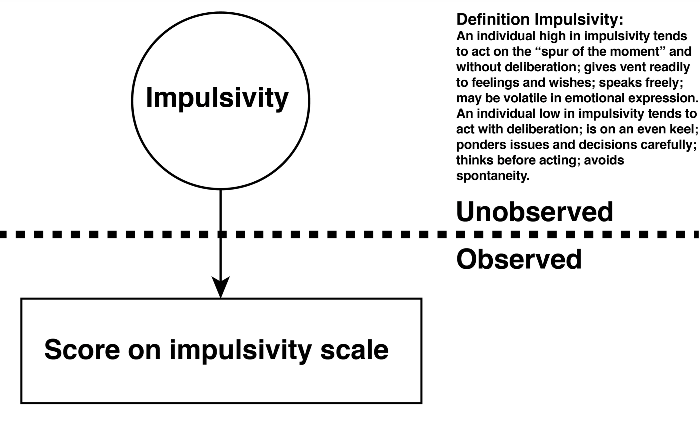
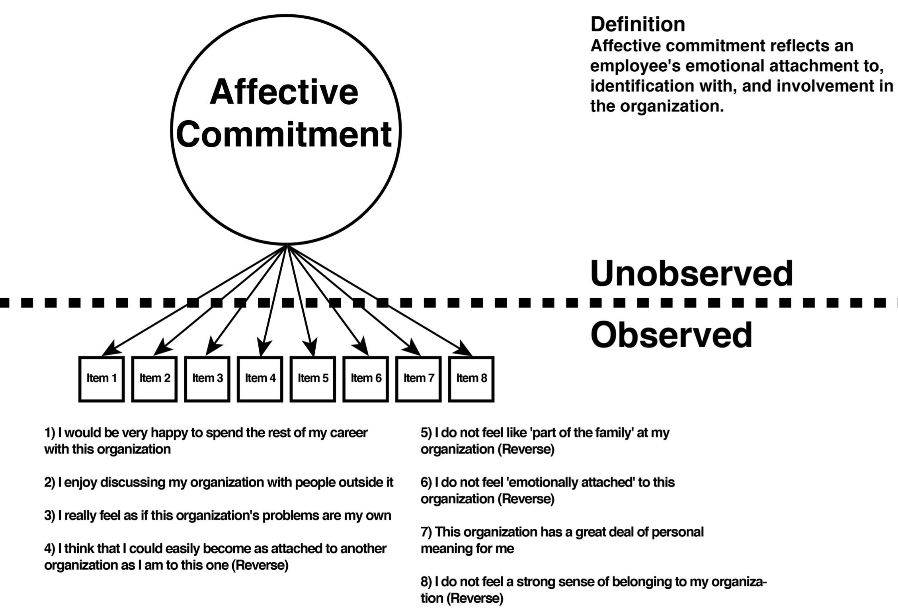
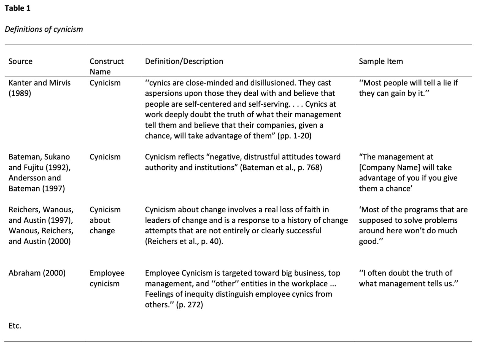
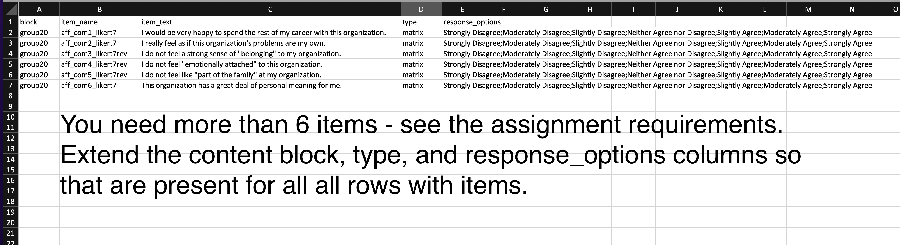

# Weeks 6/7 Friday Workshops

## Deductive scale construction

For your major project you will be creating a new uni-dimensional measure/scale using the deductive scale construction process. With this process you:

1) Create a definition of the construct you are measuring based on past research
2) Write items such that each item reflects construct definition

The idea is that psychological constructs are unobservable but we can observe people's response to items. Consider the two examples below.

### Impulsivity example

Impulsivity is a psychological trait that is unobservable and can't be measured directly. However, we can create a series of items that combine to create a **scale** (i.e., measure). The psychological trait of impulsivity (as defined by the construct definition) would be reflected in response to the items on that scale. Examine the definition of impulsivity below as an example.


```{r, echo = FALSE, out.width="60%"}

```

### Affective commitment example

Likewise, affective commitment to the organization is a psychological trait that is unobservable and can't be measured directly. However, we can create a series of items that combine to create a **scale** (i.e., measure). Examine the definition of affective commitment below. Notice how that definition is reflected in, or embodied by, each item. Do not that some items are "reverse-keyed". The items collectively represent the affective commitment scale/measure.

```{r, echo = FALSE, out.width="60%"}

```


## Definition review of the literature

As you work on your project, you need to settle on construct of interest. Imagine that you settled on the construct of employee cynicism. The first step in your research paper is to find past attempts to measure employee cynicism and evaluate them. An important first step is to collect the various definitions of cynicism - and put them in a table. Your table should include at least five definitions associated with past measurement attempts. But you may also include on your table additional definitions that are not associated with past measurement attempts (but they don't count toward the "five").  Consider the partial table displayed below which presents definitions of employee cynicism.


```{r, echo = FALSE, out.width="80%"}

```

## Creating your own definition

Review the definitions presented in your table and look for commonalities. As well, think about what you learned about the nature of the construct you are researching from the articles you read. Engage in debate with your group members about what the "essence" is of the construct you are measuring. Then write a definition that reflects your group's shared understanding of the construct. **As you write the definition make sure you write it in a manner that it will be easy to write items that reflect that definition**

## Writing items

Once your definition is complete, you should attempt to write a large number of items that reflect that definition. You will need to do multiple drafts of each items to ensure that it not only reflects the construct but also makes for a good item. We have provided two resources for writing items on ARES - see the link on the course Courselink site.

* Hinkin, T. R. (1998). A brief tutorial on the development of measures for use in survey questionnaires. Organizational research methods, 1(1), 104-121.

This is an excellent article that you should read in its entirety before you proceed with your project. But of particular interest for the current task is the section titled "Item Development". **This is must read section before you start writing your items.**

* Cohen, R.J. & Swerdlik, M.E. (2013). Psychological Testing and Assessment: An Introduction to Tests and Measurement. McGraw Hill, NY.

The chapter has excellent, and extensive, advice on writing items. 


## Item submission

To ensure full marks for you work with items be sure you do all of the following - exactly as noted - included upper/lower case distinctions. The smallest deviation - even in the case of the letters will result in a loss or marks. Why are we so strict - because once the items are submitted they are processed by the computer and the smallest deviation will cause the computer to crash.

* Ensure the FILE TYPE is correct - you should submit a .CSV file.

* Ensure the FILENAME is correct. If you were group 20 your file name would be "items_group20.csv".

* Adjust the column content. Notes for each column below but also see the example screenshot posted for clarity.

* **block** column. Make sure you put your group name in the column. If you were group 20 you would put "group20" in this column for each row.

* **block** column. Make sure you put your group name in the column. If you were group 20 you would put "group20" in this column for each row.

* **item_name** column. Use a meaningful and moderate length name for each item.

  * Make it unique by making it a long name - you want the item names to be different from other groups that may making a similar measure. 
  * Be sure to indicate in the item name the number of likert point (e.g., likert7).   * Be sure to indicate if an item is a reverse-keyed item by included "rev" after the likert indication (e.g., likert7rev). 
  * Do not use spaces in the item name
  * Only use underscore "_" as a proxy for spaces - not another character
  * Only use lower case letters
  * Include the number of the item in the name
  * Example Item 1: aff_com1_likert7
  * Example reverse-keyed Item 3: aff_com3_likert7rev
  
* **item_text** column. 

  * Begin each item with a capital letter
  * End each item with a period
  * DO NOT use commas in the item text


* **type** column. 

  * This column should only contain the word "matrix". 
  * Simply copy/paste the content of this column so that they are present for all items.
  

* **response_options** column. 

  * This column should only contain the response options for each item separated by semicolons. 
  * Simply copy/paste the content of this column so that they are present for all items.
  * Do not modify the contents of the item response cell - just copy/paste that content.


```{r, echo = FALSE, out.width="100%"}

```


