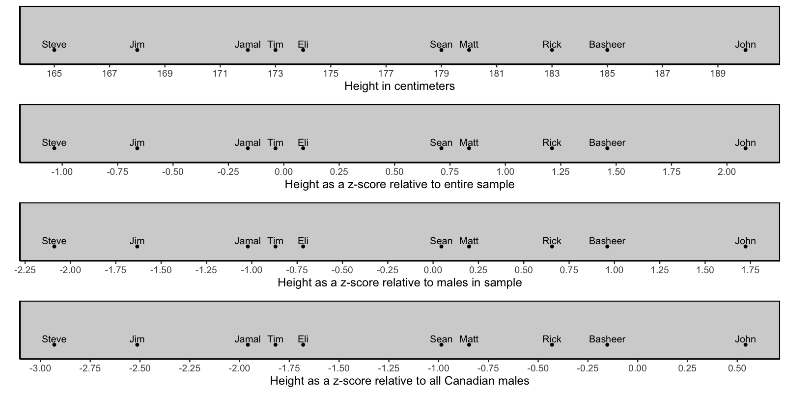

# Scaling

## Data entry

We begin by entering data into Excel (or any other spreadsheet) as per below. Notice how we use the first row as a header for the column names. Once we enter the data this way we need to save it as a .CSV file (comma separated values). You do so using the Save As menu item in Excel. Once the Save window appears - you will notice a File Format pull-down button. Use the button to select the CSV (comma delimited) option. Indicate a file name of "data_heights.csv" and save the file.

```{r, echo=FALSE, out.width="40%"}
knitr::include_graphics("ch_scaling/images/scaling_data_excel.png")
```


What is a .CSV file? It's just a text file where the columns are separated by commas. If you were to open the file in TextEdit on a Mac (or Notepad on Windows) you would see something like the image below. You don't need to do this step - but if you did, it would just show you how the file is saved on disk.

```{r, echo=FALSE, out.width="40%"}
knitr::include_graphics("ch_scaling/images/scaling_data_text.png")
```


## Loading data

Begin by creating a Project in RStudio on your computer (or via RStudio Cloud). Place the "data_heights.csv" in the Project folder. If you are using R Studio Cloud this means uploading the file via the Upload button the File tab (see picture below):

```{r, echo=FALSE, out.width="50%"}
knitr::include_graphics("ch_scaling/images/upload_button.png")
```


Prior to loading the data we have to install the tidyverse and sjstats packages. This only needs to be done once if you are using RStudio your computer. If you are using RStudio in the Cloud you need to do it once for each project/workspace. You install these packages by typing the command below in the CONSOLE. Do NOT put these commands in your script. It will take some time to run. Don't worry about all the text feedback you see on the screen.

```{r, eval = FALSE}
install.packages("tidyverse", dep = TRUE)
install.packages("sjstats", dep = TRUE)
```


From this point on place all the R commands into your script. We begin by activating the tidyverse and sjstats packages with the library() command. Then we load the data using read_csv(). Notice how use indicate missing values using the **na** argument of the read_csv() command; if the computer see nothing in the column or -999 it puts in a missing value place holder.

```{r, eval = TRUE}
library(tidyverse)
library(sjstats)

height_data <- read_csv("data_heights.csv", na = c("", "-999"))
```

We can see the columns in the data we loaded using the glimpse() command:

```{r}
glimpse(height_data)
```

The sex and part_id (participant identification number) columns are categorical variables. We need to let the R know this fact. We do so by converting them to "factor" columns with the command below.

```{r}
height_data <- height_data %>%
  mutate(part_id = as_factor(part_id),
         sex = as_factor(sex))

```

Using glimpse() again we see these columns have fct after them indicating that they are factors (i.e., categorical variables):

```{r}
glimpse(height_data)
```

## Viewing data

We can view all of the data we entered with the commands below. In these commands, we first specify the data, height_data that we want displayed. Following this we use the "and then" verb represented by "%>%". Finally, we indicate that before it is displayed the height_data should be converted to a data frame, using as.data.frame() command. Later will will include additional commands in the display script below to obtain particular rows or columns from the data set. You can read the code below as "height_data and then as.data.frame()".

```{r}
height_data %>% 
  as.data.frame()
```


## Summary statistics

To obtain the mean and standard deviation (population formula) for each column in the data set we use the commands below. These are explained in the previous "Handling data with the tidyverse" chapter. You can see in the code below that by specifying, in the summarise() command, .cols = where(is.numeric) that we obtain descriptive statistics for any numeric column.

```{r}
desired_descriptives <- list(
  mean = ~mean(.x, na.rm = TRUE),
  sd_pop = ~sd_pop(.x)
)

height_data %>%
    summarise(across(.cols = where(is.numeric),
                     .fns = desired_descriptives,
                     na.rm = TRUE)) %>%
  as.data.frame()
```


## Converting units


### Inches

In the previous section we have examined participant heights using centimeters (cm). We can, however, express participants heights using inches. It's a simple process to convert cm to inches - we simply divide by 2.54. If you examine the ruler below you can see that 2.54 cm corresponds to 1 inch.

```{r, echo=FALSE, out.width = "50%"}
knitr::include_graphics("ch_scaling/images/ruler.png")
```

#### Hand calculation

We can express this conversion more formally with equations below. In this Equation we use $X_i$ to indicate the height (in cm) of the $i^{th}$ person in a set of N people.

$$
\begin{aligned}
\text{height in inches for the ith person} = \frac{X_i}{2.54}\\
\end{aligned}
$$


In the context of our data we can convert John's height of 190 cm to inches using this process:

$$
\begin{aligned}
\text{height in inches for the ith person} &= \frac{X_i}{2.54}\\
&= \frac{\text{John's height in cm}}{2.54}\\
&= \frac{190}{2.54}\\
&= 74.80315
\end{aligned}
$$


Thus, John is 190 cm tall or 74.8 inches tall. Of course, John's height has not changed because we are now expressing it in inches. All that has changed is the units we use to indicate his height.


#### R calculation


We can use R to calculate the height in inches for everyone in the data set using the code below. The mutate() command creates a new column, inch_height, that contains each persons height in inches.

```{r}

height_data <- height_data %>%
  mutate(inch_height = cm_height / 2.54)
```

We can see the new column (inches) with the code below. The code takes the height_data "and then" (i.e., %>%) converts it to a data frame prior to displaying it on the screen. We convert it to a data frame prior to displaying in on the screen to increase the number of decimals displayed.

```{r}
height_data %>% 
  as.data.frame()
```


#### Summary

We can obtain the mean and standard deviation (population formula) for all numeric columns (i.e, the cm and inches columns) using the summarise() command below. Note that we added "%>% t()" after the as.data.frame() to change the orientation of the output. This extra command simply transposes the output row to a column to make it easier to read. You can read the code in the extra command, "%>% t()", as "and then transpose".

```{r}
desired_descriptives <- list(
  mean = ~mean(.x, na.rm = TRUE),
  sd_pop = ~sd_pop(.x)
)

height_data %>%
    summarise(across(.cols = where(is.numeric),
                     .fns = desired_descriptives,
                     na.rm = TRUE)) %>%
  as.data.frame() %>% t()
```

By converting heights in centimeters to heights in inches we are simply changed the units used to represent those heights. The conversion did not change anyone's actual height. Nor did this conversion change the height of one person relative to another person -- all we did was change the units used to represent the heights. The summary table below illustrates how the means and standard deviations are different for the different units of measurement - despite representing the same set of people who's heights where not influenced by the conversion.

Both inches and centimeters are ratio-scale scale heights. The zero point on those measurement scales is meaningful and not arbitrary. In the next section we examine two approaches to representing heights (*z*-scores and T-scores) for which the zero-point depends on the nature of the data. This initially seems like an odd approach - but you will that there are many benefits to expressing scores/heights in this manner. 


```{r, echo = FALSE}
desired_descriptives <- list(
  mean = ~mean(.x, na.rm = TRUE),
  sd_pop = ~sd_pop(.x),
  N = ~sum(!is.na(.x))
)

row_sum <- height_data %>% 
  summarise(across(.cols = where(is.numeric),
                   .fns =  desired_descriptives,
                   .names = "{col}___{fn}"))

long_summary <- row_sum %>%
  pivot_longer(cols = everything(),
               names_to = c("unit", "stat"),
               names_sep = c("___"),
               values_to = "value")

summary_table <- long_summary %>% 
  pivot_wider(names_from = stat,
              values_from = value)

# round to 3 decimals
summary_table_rounded <- summary_table %>%
  mutate(across(.cols = where(is.numeric),
                .fns= round,
                digits = 3)) %>%
  as.data.frame()

kableExtra::kable(summary_table_rounded)
```


### *z*-scores

One alternative approach to representing scores, or more specifically heights, is using *z*-scores. With *z*-scores each person's score (i.e., height) is represented relative to a frame of reference. More specifically, scores are represented relative to a particular mean and standard deviation. Often the frame of reference (i.e., mean and standard deviation) used to calculate *z*-scores is the mean and standard deviation of all the participants in a data set - though we will see later other frames of reference are possible.

The advantage of *z*-scores is that by simply looking a person's *z*-score we can tell if they are above or below the mean for the frame of reference. Specifically, when a *z*-score is positive this indicates that a person is above the mean of the frame of reference; likewise, when a *z*-score is negative this indicates that the person is below the mean of the frame of reference. The magnitude of the *z*-score indicates how distant a person is from the mean of the frame of reference in standard deviation units. 

We examine our data we find that John has a height of 190 cm. We use the heights of the people in our data set as a frame of reference. Using all of the people in our data set we calculate a mean height of 173.3 cm and a standard deviation (population formula) of 8.013114 cm. We use these values as a frame of reference when calculating John's *z*-score.

Using our data set as a frame of reference, John's height of 190 cm can be expressed as a *z*-score of 2.084084 (calculation below). Because this is a positive value we know John is taller than the average person in the frame of reference (i.e, in our data set). Likewise, the magnitude of the *z*-score, 2.084084, indicates that John is 2.084084 standard deviations taller than the average person in our frame of reference (i.e., the people in our data set). This means that John is quite tall - **relative** to the other people in our data set. The key word here is **relative** - *z*-scores provide information about a person's score relative to some frame of reference. In this example, the frame of reference was all of the people in our data set.


#### Hand calculation

Let's walk through converting John's height from cm to a *z*-score. The first step is determining the frame of reference we want to use to calculate the *z*-score. As noted previously, we use the entire data set a frame of reference. That means we need the mean and standard deviation of the entire data to calculate the *z*-score.

For the entire data set, the mean and standard deviation (population formula) in centimeters are illustrated below (obtained via the R-code in the previous section).

$$
\begin{aligned}
\overline{X} &= 173.3 \\
S_X &= 8.013114 \\
\end{aligned}
$$

To convert a person's original score to a *z*-score we use the formula below. Notice that the formula contains their original score (i.e., $X_i$) as well and the mean (i.e., $\overline{X}$) and standard deviation (i.e., $S_X$) of the frame of reference.

$$
\begin{aligned}
z_i = \frac{X_i - \overline{X}}{S_X}\\
\end{aligned}
$$


Here is the calculation for John:

$$
\begin{aligned}
z_i &= \frac{X_i - \overline{X}}{S_X}\\
&= \frac{\text{(John's height in cm)} - \overline{X}}{S_X}\\
&= \frac{190 - 173.3}{8.013114}\\
&= \frac{16.7}{8.013114}\\
&= 2.084084\\
\end{aligned}
$$


As noted previously: Because this is a positive value we know John is taller than the average person in the frame of reference (i.e, the people in our data set). Likewise, the magnitude of the *z*-score, 2.084084, indicates that John is 2.084084 standard deviations taller than the average person in our frame of reference (i.e., the people in our data set). This means that John is quite tall - **relative** to the other people in our data set. The key word here is **relative** - *z*-scores provide information about a person's score relative to some frame of reference. In this example, the frame of reference was all of the people in the data set.

#### R calculation

We can use R to calculate the *z*-score for everyone in our data set.  Previously, we found:

$$
\begin{aligned}
\overline{X} &= 173.3 \\
S_X &= 8.013114 \\
\end{aligned}
$$

Therefore, we write the code below to create *z*-scores with the entire data set as the frame of reference. More specifically, we are using the mutate() command to create a new colum called z_data. We use this column name to reflect the fact that the we are using the entire data set as the frame of reference for the *z*-score.  Also notice how the formula in the mutate() command corresponds to the formula used in the hand calculation above.

```{r, eval = TRUE}

height_data <- height_data %>%
  mutate(z_data = (  cm_height - 173.3  )  /  8.013114  )
```

Note that in the mutate() command above we specified the mean and standard deviation using specific values (i.e., 173.3 and 8.013114). However, because the mean and standard eviation came from the same data set for which we are calculating the *z*-score we could have used the more advanced code below. The more advanced code is harder to follow - so for the remainder of this chapter will continue to specify the specific values use in *z*-score calculations rather than used the more advanced code style below.

```{r, eval = FALSE}

height_data <- height_data %>%
  mutate(z_data = (  cm_height - mean(cm_height)  )  /  sd_pop(cm_height)  )
```

Once we have obtained the *z*-score we can inspect them on the screen. We do so with the code below. Notice that each person now has a *z*-score. Recall, *z*-scores below zero indicate a height below the mean of the data set (i.e., the frame of reference) whereas *z*-scores above zero indicate a height above the mean for the data set.

```{r}
height_data %>% 
  as.data.frame()
```

It's easier to see the value of *z*-scores if we sort the data prior to displaying it on the screen. We sort the data using the arrange() command. Specifically, by using the arrange(z_data) command we sort the data by the *z*-score column prior to displaying it. In the output below, it's easy to see that everyone with a *z*-score less than zero (i.e., a negative *z*-score) has a height lower than the mean for the entire data set (i.e., 193.3 cm) - which is our frame of reference.

```{r}
height_data %>% 
  arrange(z_data) %>%
  as.data.frame()
```


#### Summary

We can obtain the mean and standard deviation (population formula) for all numeric columns (i.e, the cm, inches, and *z*-score columns) using the summarise() command below.

```{r}
desired_descriptives <- list(
  mean = ~mean(.x, na.rm = TRUE),
  sd_pop = ~sd_pop(.x)
)

height_data %>%
    summarise(across(.cols = where(is.numeric),
                     .fns = desired_descriptives,
                     na.rm = TRUE)) %>%
  as.data.frame() %>% t()
```

This output may be confusing. Consider the cm_height_mean of 1.733e+02 the e+02 means move the decimal two places to the right. Likewise, consider the z_data_mean of -1.414e-15 the e-15 means move the decimal 15 places to the left.

We can see this information presented in table form below (decimals adjusted). You can see that *z*-scores are simply a way of representing heights with a different type of unit. By converting heights to *z*-scores we have not changed anyone's actual height. Nor have we changed the relative heights of any two individuals. We have only changed the units used to express those heights.

A special case: Also notice that when we use the data set itself as the frame of reference something interesting happens with *z*-scores. Specifically, the *z*-score column has a mean of zero and a standard deviation of 1.0. This won't always be the case. 

Consider two different situations. In situation 1, imagine we obtained a subset of the people in our the current data set (after the *z*-scores were calculated). If we were to calculate, for the this subset of people, the mean and standard deviation of the *z*-score column the values would not be 0 and 1, respectively. In situation 2, imagine we have the full data set, and the we calculated *z*-scores using a different frame of reference. That is we used a mean and standard deviation as the frame of reference there were not obtained from our data. In this scenario, if we calculated *z*-scores for everyone, the mean and standard deviation of the *z*-score column would likely not be 0 and 1, respectively.


```{r, echo = FALSE}
desired_descriptives <- list(
  mean = ~mean(.x, na.rm = TRUE),
  sd_pop = ~sd_pop(.x),
  N = ~sum(!is.na(.x))
)

row_sum <- height_data %>% 
  summarise(across(.cols = where(is.numeric),
                   .fns =  desired_descriptives,
                   .names = "{col}___{fn}"))

long_summary <- row_sum %>%
  pivot_longer(cols = everything(),
               names_to = c("unit", "stat"),
               names_sep = c("___"),
               values_to = "value")

summary_table <- long_summary %>% 
  pivot_wider(names_from = stat,
              values_from = value)

# round to 3 decimals
summary_table_rounded <- summary_table %>%
  mutate(across(.cols = where(is.numeric),
                .fns= round,
                digits = 3)) %>%
  as.data.frame()

kableExtra::kable(summary_table_rounded)
```

### T-scores

T-scores are simply another unit for representing scores. Do not confuse the T-score with the *t*-value in inferential statistics (a very different number).

T-scores are very similar to *z*-scores - the provide scores for each person relative to a frame of reference. With *z*-scores we use 0 to indicate the mean of the frame of reference and 1 to indicate the standard deviation of the frame of reference. With T-scores we use 50 to indicate the mean of the frame of reference and 10 to indicate the standard deviation of the frame of reference.

When T-scores are greater than 50 this indicates that a person is above the mean of the frame of reference; likewise, when a T-scores is less than 50 this indicates that a person is below the mean of the frame of reference. Every difference of 10 units from 50 represents a standard deviation. Thus, a person with a T-score of 60 is one standard deviation above the mean of the frame of reference.

In we examine our data we find that John has a height of 190 cm. We use the heights of the people in our data set as a frame of reference. To create a T-score for John we first need to convert his height in cm to a *z*-score. Following this, we convert his *z*-score to a T-score. Fortunately, we've already calculated John's height in *z*-score form for this frame of reference as 2.084084. We convert that number (calculation below) to a T-score of 70.84084. Because this T-score if greater than 50 we know John is taller than the average person in the frame of reference (i.e, the people in our data set). Likewise, the magnitude of the T-score is roughly 20 higher (i.e., 2* 10 higher) than 50 we know John is about 2 standard deviations taller than the mean for the frame of reference.

#### Hand calculation

Let's walk through converting John's height as a *z*-score to a T-score. The *z*-score used our entire data set as the frame of reference - so that will be the frame of reference for the T-score as well.

The generic formula for converting *z*-scores to T-scores is below. In this formula $T_i$ represents the new T-score whereas $z_i$ represents the previously calculated *z*-score for that person. We need to calculate the *z*-score as a first step in calculating a T-score. You can see that we simply multiply a *z*-score by 10 and add 50 to get a T-score. The resulting T-score has the same frame of reference as the *z*-score used to calculate it. 

$$
\begin{aligned}
T_i = z_i \times 10 + 50\\
\end{aligned}
$$


Here is the calculation for John:

$$
\begin{aligned}
T_i &= z_i \times 10 + 50\\
&= \text{(John's height as a z-score)} \times 10 + 50\\
&= 2.084084 * 10 + 50\\
&= 70.84084\\
\end{aligned}
$$


As noted previously: Because this T-score if greater than 50 we know John is taller than the average person in the frame of reference (i.e, the people in our data set). Likewise, the magnitude of the T-score is roughly 20 higher (i.e., 2* 10 higher) than 50 we know John is about 2 standard deviations taller than the mean for the frame of reference.

#### R calculation

We can use this same approach in R to convert all of the *z*-scores to T-scores. We use the mutate() commmand to create a new column called T_data. We use this name to indicate the the frame of reference for the T-score is the data set (i.e., T_data). Notice how the mutate() command below is just the R version of the above formula for converting *z*-scores to T-scores.

```{r}

height_data <- height_data %>%
  mutate(T_data =  z_data * 10 + 50 )
```

After running the above command, we have a new column called T_data which contains the T-score for each person. We can use the code below to display the height data. We use the select command() - specifically select(-part_id, -sex) to omit the part_id and sex columns from the output - it's too wide otherwise.  We use the arrange(T_data) command to sort the heights by T-score prior to displaying them. Inspecting the output you see the order of the rows is the same as when we sorted by *z*-score.

```{r}
height_data %>%
  select(-part_id, -sex) %>%
  arrange(T_data) %>%
  as.data.frame()
```


When you examined the output above did you notice correspondence between *z*-scores and T-scores. Whenever a *z*-score was less than 0 the corresponding T-score for that person was less than 50. Both of these values indicate a person had a height lower than the mean, 193.3 cm, for the reference group (the entire data set).


#### Summary

We can obtain the mean and standard deviation (population formula) for all numeric columns (i.e, the cm, inches, *z*-score, and T-score columns) using the summarise() command below.

```{r}
desired_descriptives <- list(
  mean = ~mean(.x, na.rm = TRUE),
  sd_pop = ~sd_pop(.x)
)

height_data %>%
    summarise(across(.cols = where(is.numeric),
                     .fns = desired_descriptives,
                     na.rm = TRUE)) %>%
  as.data.frame() %>% t()
```

We can see this information presented in table form below (decimals adjusted). You can see that T-scores are simply a way of representing heights with a different type of unit. By converting heights to T-scores we have not changed anyone's actual height. Nor have we changed the relative heights of any two individuals. We have only changed the units used to express those heights.

A special case: Also notice that when we use the data set itself as the frame of reference something interesting happens with T-scores. Specifically, the T-score column has a mean of 50 and a standard deviation of 10. This won't always be the case. If we use a frame of reference other than our data set, the mean and standard deviation of T-scores in our data set will not necessarily be equal to 50 and 10, respectively.


```{r, echo = FALSE}
desired_descriptives <- list(
  mean = ~mean(.x, na.rm = TRUE),
  sd_pop = ~sd_pop(.x),
  N = ~sum(!is.na(.x))
)

row_sum <- height_data %>% 
  summarise(across(.cols = where(is.numeric),
                   .fns =  desired_descriptives,
                   .names = "{col}___{fn}"))

long_summary <- row_sum %>%
  pivot_longer(cols = everything(),
               names_to = c("unit", "stat"),
               names_sep = c("___"),
               values_to = "value")

summary_table <- long_summary %>% 
  pivot_wider(names_from = stat,
              values_from = value)

# round to 3 decimals
summary_table_rounded <- summary_table %>%
  mutate(across(.cols = where(is.numeric),
                .fns= round,
                digits = 3)) %>%
  as.data.frame()

kableExtra::kable(summary_table_rounded)
```

## Frame of references

### All participants

In the above exercises we used the entire data set as our frame of reference. That is, the *z*-score column, z_data, was calculated using the mean and standard deviation for the data set (i.e., all participants in the data set). These values are presented below:


$$
\begin{aligned}
\overline{X} &= 173.3 \\
S_X &= 8.013114 \\
\end{aligned}
$$

Recall, that these mean and standard deviation values were used to calculate John's *z*-score (and everyone else's *z*-scores too):

$$
\begin{aligned}
z_i &= \frac{X_i - \overline{X}}{S_X}\\
&= \frac{\text{(John's height in cm)} - \overline{X}}{S_X}\\
&= \frac{190 - 173.3}{8.013114}\\
&= \frac{16.7}{8.013114}\\
&= 2.084084\\
\end{aligned}
$$


### Male reference

The frame of reference doesn't have to be the entire data set. Image we wanted to examine just the males in the data set. We could calculate a z-score using just the male data so the *z*-score would indicate how tall a male is **relative** to other other males. Depending on our research question it might be quite helpful to express male heights (i.e. male scores) in this way.

Let's use only males as our frame of reference. We can do by creating a new data set that contains only the males from our original data set. Below we create a data set called male_height_data. The code uses the filter(sex == "male") command to obtain only the rows where the sex columns indicates the participant is male (notice the use of the double equals sign, ==, to indicate "is equal to").

```{r}
male_height_data <- height_data %>%
  filter(sex == "male") 
```

You can confirm we have only males in the new data set by inspecting the data. As before, to make the output easier to read we omit some columns from the output using the select() commmand. Additionaly, use use the arrange() command or sort the output by the cm_height column. The output confirms we only have male in the new data set.

```{r}
male_height_data %>%
  select(-part_id, -T_data) %>%
  arrange(cm_height) %>%
  as.data.frame()
```

For this all male data set, we obtain the mean and standard standard deviation (population formula) for the cm_height column using the code below. You can see in the code below that by specifying, in the summarise() command, .cols = starts_with("cm_") that we obtain descriptive statistics only for columns that begin with cm_ (which is a single column).

```{r}
desired_descriptives <- list(
  mean = ~mean(.x, na.rm = TRUE),
  sd_pop = ~sd_pop(.x)
)

male_height_data %>%
    summarise(across(.cols = starts_with("cm_"),
                     .fns = desired_descriptives,
                     na.rm = TRUE)) %>%
  as.data.frame() %>% t()
```

In table form we see that for males the mean and standard deviation are 178.700	and 6.558, respectively.

```{r, echo = FALSE}
desired_descriptives <- list(
  mean = ~mean(.x, na.rm = TRUE),
  sd_pop = ~sd_pop(.x),
  N = ~sum(!is.na(.x))
)

row_sum <- male_height_data %>% 
  select(-part_id, -sex, -T_data, -z_data) %>%
  summarise(across(.cols = where(is.numeric),
                   .fns =  desired_descriptives,
                   .names = "{col}___{fn}"))

long_summary <- row_sum %>%
  pivot_longer(cols = everything(),
               names_to = c("unit", "stat"),
               names_sep = c("___"),
               values_to = "value")

summary_table <- long_summary %>% 
  pivot_wider(names_from = stat,
              values_from = value)

# round to 3 decimals
summary_table_rounded <- summary_table %>%
  mutate(across(.cols = where(is.numeric),
                .fns= round,
                digits = 3)) %>%
  as.data.frame()

kableExtra::kable(summary_table_rounded)
```

#### Hand calculation

To calculate a z-score using a male only frame of reference we need the mean and standard deviation (population formula) for males. These are presented below.

$$
\begin{aligned}
\overline{X_{males}} &= 178.7 \\
S_{males} &= 6.558 \\
\end{aligned}
$$

Previously, when we used the whole data set as a frame of reference we found that John's *z*-score was 2.084084. But now we want to calculate a *z*-score for John using only the males as a frame of reference. Therefore, we calculate his *z*-score using the mean and standard deviation for only males; as illustrated below:

$$
\begin{aligned}
z_i &= \frac{X_i - \overline{X_{males}}}{S_{males}}\\
&= \frac{\text{(John's height in cm)} - \overline{X_{males}}}{S_{males}}\\
&= \frac{190 - 178.7}{6.558}\\
&= \frac{11.3}{6.558201}\\
&= 1.723033\\
\end{aligned}
$$


#### R calculation


We can use R to calculate the *z*-score for our male only data set. We are using the mutate() command to create a new colum called z_data_males. We use this column name to reflect the fact that the we are using males from our data set as frame of reference for the new *z*-score column.  Also notice how the formula in the mutate() command corresponds to the formula used in the hand calculation above.


```{r}

male_height_data <- male_height_data %>%
  mutate(z_data_males = (cm_height - 178.7)/ 6.558  )
```


Once we have obtained the *z*-scores for males we can inspect them on the screen. We do so with the code below. In this code we use the select() command to omit a number of columns and focus on only the ones we are currently interested in. Likewise, we use arrange(z_data_males) to sort the data the z_data_males column.

```{r}
male_height_data %>%
  select(-part_id, -T_data, -inch_height) %>%
  arrange(z_data_males) %>%
  as.data.frame()
```


Examine the last row of this sorted data set to see the two *z*-scores for John. When we used the entire data set as the frame of reference (z_data) John's height was 2.08408. This value indicates that **relative to the entire data set (males and females)** John is 2.08408 standard deviations taller than the mean height for the data set. However, when we calculated a *z*-score for John **relative to only males**, the z_data_male column, his height is represented by a *z*-score of 1.72309. This indicates that John is 1.72309 standard deviations taller than the mean height for males. So relative to everyone John's height is 2.08408 but relative to only males John's height is 1.72309. John's height is the same in both cases - only the frame of reference has changed. These two frames of reference allow us to see that relative to everyone (males and females) John is taller than when his height is considered in the context of only males (2.08408 vs 1.72309, respectively). Thus, we might think of John as an extraordinarily tall person in the context of everyone (males/females) in data set but as a somewhat large person in the context of the males in the data set. 

Take a moment examine the *z*-scores for Basheer and Sean. Notice the large difference between z_data and z_data_male for these two individuals.

#### Summary

For this male only data set, we can see the summary statistics below. Notice how the mean and standard deviation for the z_data column are no longer 0 and 1, respectively. These new values occur because we are examining a subset of the entire data set. In contrast, notice how for the z_data_male column the mean and standard deviation are 0 and 1.


```{r, echo = FALSE}
desired_descriptives <- list(
  mean = ~mean(.x, na.rm = TRUE),
  sd_pop = ~sd_pop(.x),
  N = ~sum(!is.na(.x))
)

row_sum <- male_height_data %>% 
  select(-part_id, -sex, -T_data, -inch_height) %>%
  summarise(across(.cols = where(is.numeric),
                   .fns =  desired_descriptives,
                   .names = "{col}___{fn}"))

long_summary <- row_sum %>%
  pivot_longer(cols = everything(),
               names_to = c("unit", "stat"),
               names_sep = c("___"),
               values_to = "value")

summary_table <- long_summary %>% 
  pivot_wider(names_from = stat,
              values_from = value)

# round to 3 decimals
summary_table_rounded <- summary_table %>%
  mutate(across(.cols = where(is.numeric),
                .fns= round,
                digits = 3)) %>%
  as.data.frame()

kableExtra::kable(summary_table_rounded)
```


### Canadian reference

So far we have used two frame of two frames of reference: the entire data and just males from the data set. Now let's move on and consider a frame of reference that is not based our data.

Imagine that Statistics Canada has a database of the heights of all Canada Canadian males. In psychology, we would refer to this type of database as containing the normative information for height or the height norms. Examining this data from all Canadian males we find the mean and standard deviation below (I made up these values):


$$
\begin{aligned}
\overline{X_{males_canada}} &= 186.1 \\
S_{males_canada} &= 7.20 \\
\end{aligned}
$$


#### Hand calculation

We can use the normative information from all Canadian males to calculate a *z*-score for John uses **Canadian males as the frame of reference**. We do so with the hand calculation below:

$$
\begin{aligned}
z_i &= \frac{X_i - \overline{X_{males_canada}}}{S_{males_canada}}\\
&= \frac{\text{(John's height in cm)} - \overline{X_{males_canada}}}{S_{males_canada}}\\
&= \frac{190 - 186.1}{7.20}\\
&= \frac{3.9}{7.20}\\
&= 0.5416667\\
\end{aligned}
$$


We see that relative to Canadian males John's *z*-score is 0.5416667. That means that relative to Canadian males is 0.54 standard deviations taller than the mean.

#### R calculation

We can use R to calculate the *z*-score for each male in our data set **relative to all Canadian males** (i.e., relative to the height norms for males).  We are using the mutate() command to create a new colum called z_canada_males We use this column name to reflect the fact that the we are using all Canadian males as the frame of reference for the new *z*-score column.  Also notice how the formula in the mutate() command corresponds to the formula used in the hand calculation above.

```{r}

male_height_data <- male_height_data %>%
  mutate(z_canada_male = (cm_height - 186.1)/ 7.20  )
```


We see the new z_canada_male column (and the old *z*-score columns) with the code below.

```{r}
male_height_data %>%
  select(-part_id, -sex, -T_data, -inch_height) %>%
  arrange(cm_height) %>%
  as.data.frame()
```

Examine the table above table above and contrast the values of the z_data, z_data_male, and z_canada_male columns. Each column index the height of the males in our data set relative to a different frame of reference.

We can can consider the values for a single person, Sean, by using the filter command below:


```{r}
male_height_data %>%
  filter(name == "Sean") %>%
  select(-part_id, -sex, -T_data, -inch_height) %>%
  arrange(cm_height) %>%
  as.data.frame()
```

Examine Sean's *z*-scores in the output above. When we consider Sean's height relative to everyone in the data set he is 0.7113 above the mean. That is, relative to everyone in the data set Sean is slightly tall. But when we consider Sean's height relative to only males in the data set he is 0.04575 standard deviations above the mean. That is when considering only males in the data set Sean is roughly average in height (0.04575 is very close to 0; or roughly 0). In contrast, when we consider Sean's height relative to all Canadian males we obtain a *z*-score of -0.9861. This indicates that relative to all Canadian males Sean is almost 1 standard deviation below the mean. That is, relative to all Canadian males Sean is somewhat short. The value of *z*-score is that they provide you with a number that allows easily consider a person's score relative to a frame of reference.


## Summary

By the end of this activity we represented the heights of male in many different ways - presented in the table below.

```{r, echo = FALSE}
male_height_data %>%
  select(-part_id, -sex, -T_data, -inch_height) %>%
  arrange(cm_height) %>%
  as.data.frame()
```

Previously we discussed how you can think of height in centimeter vs inches using the analogy of a ruler - as illustrated below.

```{r, echo=FALSE, out.width = "50%"}
knitr::include_graphics("ch_scaling/images/ruler.png")
```


The same applies with *z*-scores. You can think of each *z*-score calculation as forming a different ruler -- as illustrated below.


```{r, include = FALSE}

cm_plot <- ggplot(data = male_height_data, aes(label = name)) +
  geom_point(mapping = aes(x = cm_height,y = 1), size = 3) +
  geom_text(mapping = aes(x = cm_height,y = 1), size = 7, nudge_y = .01) +
  xlab("Height in centimeters") +
  ylab("") +
  scale_x_continuous(breaks = seq(165, 190, by = 2)) +
  scale_y_continuous(breaks = seq(3,4)) +
  coord_cartesian(ylim = c(.98, 1.07)) +
  theme_classic(24) +
  theme(panel.border = element_rect(colour = "black", fill=NA, size=2),
        panel.background = element_rect(fill = "lightgrey",
                                colour = "lightgrey",
                                size = 0.5, linetype = "solid"))


z_plot <- ggplot(data = male_height_data, aes(label = name)) +
  geom_point(mapping = aes(x = z_data,y = 1), size = 3) +
  geom_text(mapping = aes(x = z_data,y = 1), size = 7, nudge_y = .01) +
  xlab("Height as a z-score relative to entire sample") +
  ylab("") +
  scale_x_continuous(breaks = seq(-3,3, by = .25)) +
  scale_y_continuous(breaks = seq(3,4)) +
  coord_cartesian(ylim = c(.98, 1.07)) +
  theme_classic(24) +
  theme(panel.border = element_rect(colour = "black", fill=NA, size=2),
        panel.background = element_rect(fill = "lightgrey",
                                colour = "lightgrey",
                                size = 0.5, linetype = "solid"))

z_male_plot <- ggplot(data = male_height_data, aes(label = name)) +
  geom_point(mapping = aes(x = z_data_males,y = 1), size = 3) +
  geom_text(mapping = aes(x = z_data_males,y = 1), size = 7, nudge_y = .01) +
  xlab("Height as a z-score relative to males in sample") +
  ylab("") +
  scale_x_continuous(breaks = seq(-3,3, by = .25)) +
  scale_y_continuous(breaks = seq(3,4)) +
  coord_cartesian(ylim = c(.98, 1.07)) +
  theme_classic(24) +
  theme(panel.border = element_rect(colour = "black", fill=NA, size=2),
        panel.background = element_rect(fill = "lightgrey",
                                colour = "lightgrey",
                                size = 0.5, linetype = "solid"))

z_can_male_plot <- ggplot(data = male_height_data, aes(label = name)) +
  geom_point(mapping = aes(x = z_canada_male,y = 1), size = 3) +
  geom_text(mapping = aes(x = z_canada_male,y = 1), size = 7, nudge_y = .01) +
  xlab("Height as a z-score relative to all Canadian males") +
  ylab("") +
  scale_x_continuous(breaks = seq(-3,3, by = .25)) +
  scale_y_continuous(breaks = seq(3,4)) +
  coord_cartesian(ylim = c(.98, 1.07)) +
  theme_classic(24) +
  theme(panel.border = element_rect(colour = "black", fill=NA, size=2),
        panel.background = element_rect(fill = "lightgrey",
                                colour = "lightgrey",
                                size = 0.5, linetype = "solid"))


png(filename = "ch_scaling/images/zruler.png", width = 1600, height = 800)
gridExtra::grid.arrange(cm_plot, z_plot, z_male_plot, z_can_male_plot, nrow = 4)
dev.off()
```

```{r, echo = FALSE}

```


If you inspect the summary table below you see the z_canada_male column has a mean of -1.028. This indicate that the average height of the males in our data set is 1.028 standard deviations below the mean height for Canadian males. Consequently, relative to all Canadian males, the males in our sample tend to be short.


```{r, echo = FALSE}
desired_descriptives <- list(
  mean = ~mean(.x, na.rm = TRUE),
  sd_pop = ~sd_pop(.x),
  N = ~sum(!is.na(.x))
)

row_sum <- male_height_data %>% 
  select(-part_id, -sex, -T_data, -inch_height) %>%
  summarise(across(.cols = where(is.numeric),
                   .fns =  desired_descriptives,
                   .names = "{col}___{fn}"))

long_summary <- row_sum %>%
  pivot_longer(cols = everything(),
               names_to = c("unit", "stat"),
               names_sep = c("___"),
               values_to = "value")

summary_table <- long_summary %>% 
  pivot_wider(names_from = stat,
              values_from = value)

# round to 3 decimals
summary_table_rounded <- summary_table %>%
  mutate(across(.cols = where(is.numeric),
                .fns= round,
                digits = 3)) %>%
  as.data.frame()

kableExtra::kable(summary_table_rounded)
```

